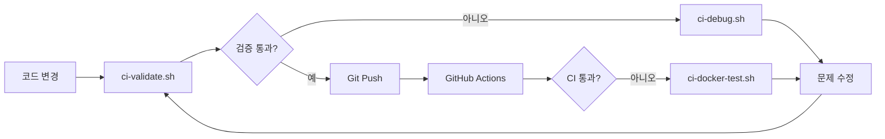

# CI 디버깅 가이드

## 🚀 개요

GitHub Actions CI 파이프라인과 동일한 환경을 로컬에서 재현하고 디버깅할 수 있는 도구 모음입니다.

## 📋 제공되는 스크립트

### 1. `scripts/ci-local-test.sh`
**목적**: GitHub Actions와 동일한 테스트를 로컬에서 실행

```bash
# 전체 CI 파이프라인 실행
./scripts/ci-local-test.sh

# 백엔드만 테스트
./scripts/ci-local-test.sh --backend-only

# 프론트엔드만 테스트
./scripts/ci-local-test.sh --frontend-only

# Docker 빌드만 테스트
./scripts/ci-local-test.sh --docker-only
```

**필요 환경**:
- Python 3.12
- Node.js 18
- Docker
- MongoDB (자동으로 Docker 컨테이너로 실행됨)

### 2. `scripts/ci-docker-test.sh`
**목적**: Docker 컨테이너 내에서 정확한 CI 환경 재현

```bash
# CI와 완전히 동일한 Ubuntu 환경에서 테스트
./scripts/ci-docker-test.sh
```

**특징**:
- Ubuntu 22.04 환경 (GitHub Actions와 동일)
- 모든 의존성 자동 설치
- 네트워크 격리된 환경

### 3. `scripts/ci-debug.sh`
**목적**: CI 실패 원인 분석 및 자동 수정 제안

```bash
# 모든 문제 점검
./scripts/ci-debug.sh

# TypeScript 오류만 점검
./scripts/ci-debug.sh typescript

# Python 린팅만 점검
./scripts/ci-debug.sh python

# 테스트 실패만 점검
./scripts/ci-debug.sh tests
```

**제공 기능**:
- 상세한 오류 분석
- 자동 수정 제안
- 일반적인 문제 패턴 감지

### 4. `scripts/ci-validate.sh`
**목적**: Git push 전 CI 통과 여부 사전 검증

```bash
# 전체 검증 (권장)
./scripts/ci-validate.sh full

# 빠른 검증 (기본 테스트만)
./scripts/ci-validate.sh quick
```

**검증 항목**:
- ✅ TypeScript 컴파일
- ✅ Python 린팅 (Ruff)
- ✅ 유닛 테스트
- ✅ 빌드 테스트
- ✅ Docker 빌드
- ✅ 코드 품질 검사
- ✅ 테스트 커버리지
- ✅ 번들 크기

## 🔧 일반적인 CI 문제 해결

### TypeScript 오류 (TS6133, TS2345 등)

**문제**: 사용하지 않는 변수, 타입 불일치
```bash
# 자동 수정 시도
cd frontend && npm run lint

# 수동으로 확인
./scripts/ci-debug.sh typescript
```

### Python 린팅 오류

**문제**: Ruff 린팅 규칙 위반
```bash
# 자동 수정
cd backend && ruff check . --fix

# 수동으로 확인
./scripts/ci-debug.sh python
```

### 테스트 실패

**문제**: 유닛 테스트 또는 통합 테스트 실패
```bash
# 로컬에서 재현
./scripts/ci-local-test.sh

# 상세 디버깅
./scripts/ci-debug.sh tests
```

### MongoDB 연결 오류

**문제**: 테스트 DB 연결 실패
```bash
# MongoDB 컨테이너 재시작
docker stop musashi-test-mongodb
docker rm musashi-test-mongodb
./scripts/ci-local-test.sh --backend-only
```

## 📊 CI 워크플로우



## 💡 모범 사례

1. **커밋 전 검증**: 항상 `ci-validate.sh`를 실행하여 CI 통과 확인
2. **실패 시 디버깅**: `ci-debug.sh`로 문제 원인 파악
3. **로컬 재현**: `ci-local-test.sh`로 정확한 CI 환경 재현
4. **Docker 격리**: 환경 문제 의심 시 `ci-docker-test.sh` 사용

## 🚨 주의사항

- 스크립트 실행 전 Docker가 실행 중인지 확인
- Python 3.12와 Node.js 18이 설치되어 있어야 함
- 테스트 중 포트 27017, 27018이 사용됨 (MongoDB)
- 테스트 후 자동으로 정리되지만, 수동 정리가 필요할 수 있음:
  ```bash
  docker ps -a | grep musashi | awk '{print $1}' | xargs docker rm -f
  ```

## 📈 성능 팁

- `ci-validate.sh quick`: 빠른 검증 (약 1-2분)
- `ci-validate.sh full`: 완전한 검증 (약 3-5분)
- 병렬 실행: 백엔드와 프론트엔드 테스트를 별도 터미널에서 실행

## 🆘 문제 해결

문제가 지속되면:
1. 캐시 정리: `rm -rf frontend/node_modules backend/venv`
2. Docker 정리: `docker system prune -a`
3. 의존성 재설치: `npm ci` (frontend), `pip install -r requirements.txt` (backend)
4. GitHub Actions 로그 확인: Actions 탭에서 상세 로그 확인