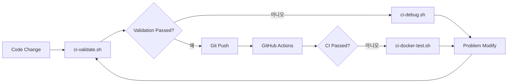

# CI 디버깅 Guide

# # 🚀 Overview

GitHub Actions CI 파이프라인과 동Day한 Environment을 로컬에서 재현하고 디버깅할 수 있는 Tool 모음입니다.

# # 📋 제공되는 Script

### 1. `scripts/ci-local-test.sh`
**Purpose**: GitHub Actions와 동Day한 Testing를 로컬에서 Execute

```bash
# 전체 CI 파이프라인 Execute
./scripts/ci-local-test.sh

# Backend만 Testing
./scripts/ci-local-test.sh --backend-only

# Frontend만 Testing
./scripts/ci-local-test.sh --frontend-only

# Docker Build만 Testing
./scripts/ci-local-test.sh --docker-only
```

**필요 Environment**:
- Python 3.12
- Node.js 18
- Docker
- MongoDB (Auto으로 Docker Container로 Execute됨)

### 2. `scripts/ci-docker-test.sh`
**Purpose**: Docker Container 내에서 정확한 CI Environment 재현

```bash
# CI와 완전히 동Day한 Ubuntu Environment에서 Testing
./scripts/ci-docker-test.sh
```

**특징**:
- Ubuntu 22.04 Environment (GitHub Actions와 동Day)
- 모든 Dependencies Auto 설치
- Network 격리된 Environment

### 3. `scripts/ci-debug.sh`
**Purpose**: CI Failed Cause Analysis 및 Auto Modify 제안

```bash
# 모든 Problem Check
./scripts/ci-debug.sh

# TypeScript Error만 Check
./scripts/ci-debug.sh typescript

# Python 린팅만 Check
./scripts/ci-debug.sh python

# Testing Failed만 Check
./scripts/ci-debug.sh tests
```

**제공 Feature**:
- 상세한 Error Analysis
- Auto Modify 제안
- Day반적인 Problem Pattern 감지

### 4. `scripts/ci-validate.sh`
**Purpose**: Git push 전 CI Passed 여부 사전 Validation

```bash
# 전체 Validation (권장)
./scripts/ci-validate.sh full

# 빠른 Validation (Default Testing만)
./scripts/ci-validate.sh quick
```

**Validation Item**:
- ✅ TypeScript 컴File
- ✅ Python 린팅 (Ruff)
- ✅ 유닛 Testing
- ✅ Build Testing
- ✅ Docker Build
- ✅ Code Quality Inspection
- ✅ Testing 커버리지
- ✅ 번들 Size

# # 🔧 Day반적인 CI Problem Resolve

# # # TypeScript Error (TS6133, TS2345 등)

**Problem**: 사용하지 않는 Variables, Type 불Day치
```bash
# Auto Modify Hour도
cd frontend && npm run lint

# Manual으로 Confirm
./scripts/ci-debug.sh typescript
```

# # # Python 린팅 Error

**Problem**: Ruff 린팅 Rules 위반
```bash
# Auto Modify
cd backend && ruff check . --fix

# Manual으로 Confirm
./scripts/ci-debug.sh python
```

### Testing Failed

**Problem**: 유닛 Testing 또는 Integration Testing Failed
```bash
# 로컬에서 재현
./scripts/ci-local-test.sh

# 상세 디버깅
./scripts/ci-debug.sh tests
```

### MongoDB Connect Error

**Problem**: Testing DB Connect Failed
```bash
# MongoDB Restart container
docker stop musashi-test-mongodb
docker rm musashi-test-mongodb
./scripts/ci-local-test.sh --backend-only
```

# # 📊 CI 워크플로우



# # 💡 모범 사례

1. **Commit 전 Validation**: 항상 `ci-validate.sh`를 Execute하여 CI Passed Confirm
2. **Failed Hour 디버깅**: `ci-debug.sh`로 Problem Cause 파악
3. **로컬 재현**: `ci-local-test.sh`로 정확한 CI Environment 재현
4. **Docker 격리**: Environment Problem 의심 Hour `ci-docker-test.sh` 사용

## 🚨 Notes

- Script Execute 전 Docker가 Execute 중인지 Confirm
- Python 3.12와 Node.js 18이 설치되어 있어야 함
- Testing 중 Port 27017, 27018이 사용됨 (MongoDB)
- Testing 후 Auto으로 정리되지만, Manual 정리가 필요할 수 있음:
  ```bash
  docker ps -a | grep musashi | awk '{print $1}' | xargs docker rm -f
  ```

## 📈 Performance Tip

- `ci-validate.sh quick`: 빠른 Validation (약 1-2Minute)
- `ci-validate.sh full`: 완전한 Validation (약 3-5Minute)
- 병렬 Execute: Backend와 Frontend Testing를 별도 터미널에서 Execute

# # 🆘 Problem Resolve

Problem가 지속되면:
1. Cache 정리: `rm -rf frontend/node_modules backend/venv`
2. Docker 정리: `docker system prune -a`
3. Dependencies 재설치: `npm ci` (frontend), `pip install -r requirements.txt` (backend)
4. GitHub Actions Check logs: Actions 탭에서 상세 Check logs