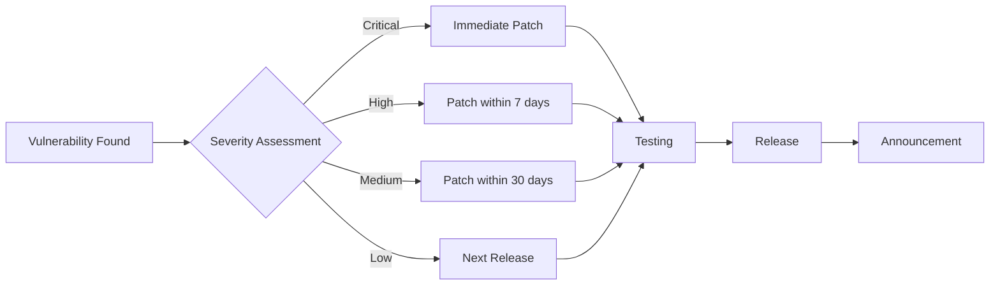

# 🔐 Security Policy

## 📋 Table of Contents

- [Supported Versions](#supported-versions)
- [Reporting Vulnerabilities](#reporting-vulnerabilities)
- [Security Scan Policy](#security-scan-policy)
- [Container Signing Policy](#container-signing-policy)
- [Security Update Process](#security-update-process)
- [Security Best Practices](#security-best-practices)
- [Reward Program](#reward-program)

## Supported Versions

Versions currently supported with security updates:

| Version | Support Status | Security Updates | End of Support | Notes |
|---------|----------------|------------------|----------------|-------|
| 1.0.x | ✅ Current Version | ✅ All Levels | 2026-01-20 | LTS (Long Term Support) |
| 0.9.x | ⚠️ Limited Support | ⚠️ Critical Only | 2025-01-20 | Security patches only |
| < 0.9 | ❌ End of Life | ❌ | 2024-12-31 | Upgrade required |

### Version Policy

**LTS (Long Term Support) Versions:**
- 2 years of full security support
- 1 additional year of Critical patch support
- New LTS version released every January

**Regular Versions:**
- 6 months of full security support
- 3 months of Critical patches only
- Quarterly new version releases

**Support Levels:**
- **Full Support**: All security vulnerability patches (Critical, High, Medium, Low)
- **Limited Support**: Critical vulnerabilities only
- **End of Life**: No patches provided, immediate upgrade recommended

> **Important**: Always use supported versions in production environments. End-of-life versions can pose serious security risks.

## Reporting Vulnerabilities

We welcome vulnerability reports for the security of the Musashi project. Please follow the principles of Responsible Disclosure.

### 🚨 Vulnerability Reporting Process

#### 1. Private Disclosure (Recommended)

**Report via GitHub Security Advisory (Recommended):**
1. Visit [Security Advisories](https://github.com/imiml/musashi/security/advisories/new) page
2. Click "Report a vulnerability"
3. Provide detailed information:
   - **Title**: Clear and concise vulnerability summary
   - **Vulnerability Type**: SQL Injection, XSS, CSRF, RCE, etc.
   - **Severity Assessment**: CVSS score or Critical/High/Medium/Low
   - **Affected Versions**: e.g., 1.0.0 ~ 1.0.5
   - **Reproduction Steps**: 
     ```
     1. Access login page
     2. Enter ' OR '1'='1 in username field
     3. Enter any password and login
     4. Confirm authentication bypass
     ```
   - **Impact Scope**: Data breach, privilege escalation, denial of service, etc.
   - **PoC (Proof of Concept)**: Code or script
   - **Suggested Fix**: Possible patch methods

**Report via Email:**
```
To: security@musashi.dev
Subject: [SECURITY] Vulnerability Report - [Vulnerability Type]

Hello Musashi Security Team,

I would like to report the following security vulnerability:

## Vulnerability Overview
- Type: [e.g., SQL Injection]
- Severity: [Critical/High/Medium/Low]
- Affected Versions: [e.g., 1.0.0 ~ 1.0.5]

## Reproduction Steps
1. [Step-by-step reproduction method]
2. ...

## Impact
[Description of vulnerability impact]

## PoC Code
[Provide if available]

## Suggested Fix
[Optional]

Thank you.
[Reporter Name]
```

#### 2. PGP Encryption (Optional)

For sensitive information, you can use PGP encryption:

```bash
# Download PGP Public Key
curl https://musashi.dev/security/pgp-key.asc | gpg --import

# Encrypt message
gpg --encrypt --recipient security@musashi.dev report.txt
```

PGP Fingerprint: `1234 5678 90AB CDEF 1234 5678 90AB CDEF 1234 5678`

### ⏱️ Response Time

| Severity | Initial Response | Patch Target | Disclosure |
|----------|------------------|--------------|------------|
| Critical | Within 24 hours | 72 hours | Immediately after patch |
| High | Within 48 hours | 7 days | 24 hours after patch |
| Medium | Within 7 days | 30 days | 7 days after patch |
| Low | Within 14 days | 90 days | Next release |

### ❌ Out of Scope

The following are not considered vulnerabilities:
- Vulnerabilities in non-latest versions
- Already disclosed vulnerabilities
- Issues due to misconfiguration
- Social engineering
- DDoS attacks
- Spam

## Security Scan Policy

### 🔍 Automated Security Scanning

All code and container images are automatically scanned with the following tools:

#### 1. Trivy Scan Policy

**Scan Targets:**
- Docker images
- Dependency packages
- Infrastructure as Code (IaC)
- Configuration files

**Build Failure Conditions:**
```yaml
# .github/workflows/release.yml에 구현됨
- name: Run Trivy vulnerability scanner
  uses: aquasecurity/trivy-action@master
  with:
    image-ref: ${{ env.REGISTRY }}/${{ github.repository_owner }}/${{ env.IMAGE_NAME }}:${{ github.ref_name }}
    format: 'sarif'
    output: 'trivy-results.sarif'
    severity: 'HIGH,CRITICAL'
    exit-code: '1'  # HIGH/CRITICAL 발견 Hour Build Failed
    ignore-unfixed: true
    vuln-type: 'os,library'
    scanners: 'vuln,secret,config'
```

**Severity Handling:**
- **CRITICAL**: Immediate build failure, patch within 24 hours
- **HIGH**: Build failure, patch within 7 days
- **MEDIUM**: Warning issued, patch within 30 days
- **LOW**: Logged, addressed in next release

**Exception Handling (False Positives):**
```yaml
# .trivyignore
# Known False Positives
CVE-2023-12345  # No impact on our environment (reason explained)
CVE-2023-67890  # Mitigation applied (PR #123)
```

#### 2. Additional Security Scanning Tools

**CodeQL (Source Code Analysis):**
```yaml
- name: Initialize CodeQL
  uses: github/codeql-action/init@v3
  with:
    languages: python, javascript
    
- name: Perform CodeQL Analysis
  uses: github/codeql-action/analyze@v3
```

**Dependabot (Dependency Updates):**
```yaml
# .github/dependabot.yml
version: 2
updates:
  - package-ecosystem: "pip"
    directory: "/backend"
    schedule:
      interval: "weekly"
    open-pull-requests-limit: 10
    
  - package-ecosystem: "npm"
    directory: "/frontend"
    schedule:
      interval: "weekly"
    open-pull-requests-limit: 10
```

**SAST/DAST Integration:**
- Snyk: Real-time vulnerability monitoring
- SonarQube: Code quality and security analysis
- OWASP ZAP: Dynamic security testing

### 📊 Scan Result Reports

Scan results are available at:
- GitHub Security tab
- CI/CD pipeline logs
- Security section in release notes

## Container Signing Policy

### 🔏 Cosign Keyless Signing

All official container images are signed using Cosign.

#### Signing Process

**Automatic Signing (CI/CD):**
```yaml
# .github/workflows/release.yml에 구현됨
- name: Install Cosign
  uses: sigstore/cosign-installer@v3
  with:
    cosign-release: 'v2.2.2'

- name: Sign container images
  env:
    COSIGN_EXPERIMENTAL: 1
  run: |
    # Keyless 서명 (OIDC 기반)
    IMAGE_DIGEST="${{ steps.build.outputs.digest }}"
    IMAGE_NAME="${{ env.REGISTRY }}/${{ github.repository_owner }}/${{ env.IMAGE_NAME }}"
    
    # Image 서명
    cosign sign --yes "${IMAGE_NAME}@${IMAGE_DIGEST}"
    cosign sign --yes "${IMAGE_NAME}:${{ github.ref_name }}"
    
    # SBOM 첨부 및 서명
    cosign attach sbom --sbom musashi-sbom.spdx.json "${IMAGE_NAME}:${{ github.ref_name }}"
    cosign sign --yes --attachment sbom "${IMAGE_NAME}:${{ github.ref_name }}"
```

**Signing Policy:**
- ✅ All production images must be signed
- ✅ Use keyless signing (no private key management needed)
- ✅ Include and sign SBOM
- ✅ Record in Transparency Log

#### Signature Verification

**User Verification Method:**
```bash
# Verify image signature
cosign verify ghcr.io/imiml/musashi:latest \
  --certificate-oidc-issuer https://token.actions.githubusercontent.com \
  --certificate-identity-regexp 'https://github\.com/imiml/musashi/\.github/workflows/.*'

# Successful verification output
Verification for ghcr.io/imiml/musashi:latest --
The following checks were performed on each of these signatures:
  - The cosign claims were validated
  - Existence of the claims in the transparency log was verified offline
  - The signatures were verified against the specified public key
```

**Policy Violations:**
- Unsigned images blocked from deployment
- Container execution denied on verification failure
- Security alerts sent

### 📦 SBOM (Software Bill of Materials)

**SBOM Generation and Management:**
```bash
# Generate SBOM (using Syft)
syft ghcr.io/imiml/musashi:latest \
  --output spdx-json \
  --file musashi-sbom.spdx.json \
  --name "musashi" \
  --catalogers all

# Download and verify SBOM
cosign download sbom ghcr.io/imiml/musashi:latest > musashi-sbom.json
cat musashi-sbom.json | jq '.packages | length'
```

**SBOM Includes:**
- All packages and versions
- License information
- Dependency tree
- Vulnerability mapping

## Security Update Process

### 🔄 Update Workflow



### 📢 Security Announcements

**Announcement Channels:**
- GitHub Security Advisories
- Security badge in project README.md
- Release notes

**Announcement Format:**
```markdown
## Security Update [CVE-2024-XXXXX]

**Severity**: High
**Affected Versions**: 1.0.0 - 1.5.2
**Patched Version**: 1.5.3
**Disclosure Date**: 2024-01-20

### Description
[Vulnerability description]

### Impact
[Impact scope description]

### Resolution
1. Update to latest version: `docker pull ghcr.io/imiml/musashi:v1.5.3`
2. Or apply mitigation: [Mitigation method]

### Credits
Reporter: @security-researcher
```

## Security Best Practices

### 🛡️ Development Security

**Code Level:**
```python
# ✅ Good: Parameterized query
async def get_user(user_id: str):
    return await db.users.find_one({"_id": ObjectId(user_id)})

# ❌ Bad: NoSQL injection vulnerable
async def get_user(user_id: str):
    return await db.users.find_one({"_id": {"$eq": user_id}})
```

**Environment Variables:**
```python
# ✅ Good: Using environment variables
from app.core.config import settings
SECRET_KEY = settings.SECRET_KEY

# ❌ Bad: Hardcoding
SECRET_KEY = "my-secret-key-123"
```

**Dependency Management:**
```bash
# Regular updates
pip list --outdated
npm audit fix

# Vulnerability checks
pip-audit
npm audit
```

### 🔒 Operational Security

**Container Security:**
```dockerfile
# ✅ Good: Minimal privilege user
RUN useradd -m -u 1000 appuser
USER appuser

# ❌ Bad: root user
USER root
```

**Network Security:**
```yaml
# Docker Compose network isolation
networks:
  internal:
    internal: true  # Block external access
  external:
    internal: false
```

**Secret Management:**
```bash
# Using Docker Secrets
docker secret create db_password password.txt

# Kubernetes Secrets
kubectl create secret generic api-key \
  --from-literal=key=your-api-key
```

### 📝 Security Checklist

**Pre-deployment Checklist:**
- [ ] Verify all dependencies are up to date
- [ ] Pass security scans (Trivy, CodeQL)
- [ ] Validate environment variables
- [ ] Verify SSL/TLS configuration
- [ ] Enable logging and monitoring
- [ ] Establish backup and recovery plan
- [ ] Minimize access permissions
- [ ] Sign container images

## Reward Program

### 💰 Bug Bounty

Rewards for vulnerability reports:

| Severity | Reward Range | Conditions |
|----------|--------------|------------|
| Critical | $500 - $2,000 | RCE, data breach |
| High | $200 - $500 | Authentication bypass, XSS |
| Medium | $50 - $200 | CSRF, information disclosure |
| Low | Thank you letter | Other security improvements |

**Reward Conditions:**
- First reporter only
- Follows responsible disclosure principles
- Valid PoC provided
- Production environment impact

### 🏆 Hall of Fame

Security researchers who contributed:
- None yet (Be the first reporter!)

## Security Headers Configuration

### Nginx Security Headers (Recommended)

```nginx
# /etc/nginx/conf.d/security.conf
add_header X-Frame-Options "SAMEORIGIN" always;
add_header X-Content-Type-Options "nosniff" always;
add_header X-XSS-Protection "1; mode=block" always;
add_header Referrer-Policy "strict-origin-when-cross-origin" always;
add_header Content-Security-Policy "default-src 'self'; script-src 'self' 'unsafe-inline'; style-src 'self' 'unsafe-inline'; img-src 'self' data: https:;" always;
add_header Strict-Transport-Security "max-age=31536000; includeSubDomains" always;
add_header Permissions-Policy "geolocation=(), microphone=(), camera=()" always;
```

## Compliance

Musashi complies with the following security standards:
- OWASP Top 10
- CIS Docker Benchmark
- NIST Cybersecurity Framework
- PCI DSS (where applicable)

## Contact and Support

**Security Team Contact:**
- 📧 Email: security@musashi.dev
- 🔐 PGP Key: [Download](https://musashi.dev/security/pgp-key.asc)
- 📱 Emergency Contact: Use GitHub Security Advisory

**Additional Resources:**
- [Security Whitepaper](https://docs.musashi.dev/security)
- [Release Notes](https://github.com/imiml/musashi/releases)
- [Security Roadmap](https://github.com/imiml/musashi/security)

---

*This security policy is regularly reviewed and updated.*  
*Last updated: January 2024*