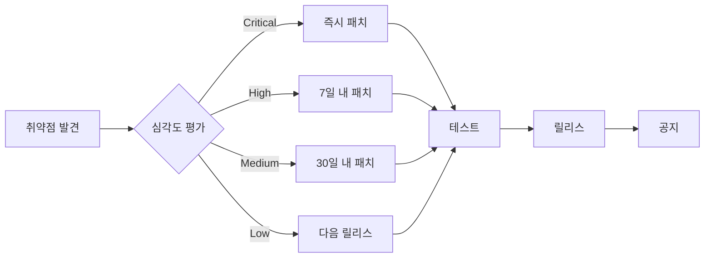

# 🔐 보안 정책 (Security Policy)

## 📋 목차

- [지원 버전](#지원-버전)
- [취약점 제보 방법](#취약점-제보-방법)
- [보안 스캔 정책](#보안-스캔-정책)
- [컨테이너 서명 정책](#컨테이너-서명-정책)
- [보안 업데이트 프로세스](#보안-업데이트-프로세스)
- [보안 모범 사례](#보안-모범-사례)
- [보상 프로그램](#보상-프로그램)

## 지원 버전

현재 보안 업데이트가 지원되는 버전:

| 버전 | 지원 상태 | 보안 업데이트 | 지원 종료일 | 비고 |
|------|-----------|---------------|-------------|------|
| 1.0.x | ✅ 현재 버전 | ✅ 모든 레벨 | 2026-01-20 | LTS (Long Term Support) |
| 0.9.x | ⚠️ 제한적 지원 | ⚠️ Critical만 | 2025-01-20 | 보안 패치만 제공 |
| < 0.9 | ❌ 지원 종료 | ❌ | 2024-12-31 | 업그레이드 필요 |

### 버전 정책

**LTS (Long Term Support) 버전:**
- 2년간 전체 보안 지원
- 1년간 추가 Critical 패치 지원
- 매년 1월 새로운 LTS 버전 출시

**일반 버전:**
- 6개월간 전체 보안 지원
- 3개월간 Critical 패치만 지원
- 분기별 새 버전 출시

**지원 수준:**
- **전체 지원**: 모든 보안 취약점 패치 (Critical, High, Medium, Low)
- **제한적 지원**: Critical 취약점만 패치
- **지원 종료**: 패치 제공 안 함, 즉시 업그레이드 권장

> **중요**: 프로덕션 환경에서는 항상 지원되는 버전을 사용하세요. 지원 종료된 버전은 심각한 보안 위험을 초래할 수 있습니다.

## 취약점 제보 방법

Musashi 프로젝트의 보안을 위해 취약점 제보를 환영합니다. 책임감 있는 공개(Responsible Disclosure) 원칙에 따라 주세요.

### 🚨 취약점 제보 절차

#### 1. 비공개 제보 (권장)

**GitHub Security Advisory를 통한 제보 (권장):**
1. [Security Advisories](https://github.com/imiml/musashi/security/advisories/new) 페이지 방문
2. "Report a vulnerability" 클릭
3. 상세 정보 제공:
   - **제목**: 간단명료한 취약점 요약
   - **취약점 유형**: SQL Injection, XSS, CSRF, RCE 등
   - **심각도 평가**: CVSS 점수 또는 Critical/High/Medium/Low
   - **영향받는 버전**: 예: 1.0.0 ~ 1.0.5
   - **재현 단계**: 
     ```
     1. 로그인 페이지 접속
     2. 사용자명 필드에 ' OR '1'='1 입력
     3. 임의 비밀번호 입력 후 로그인
     4. 인증 우회 확인
     ```
   - **영향 범위**: 데이터 유출, 권한 상승, 서비스 거부 등
   - **PoC (Proof of Concept)**: 코드 또는 스크립트
   - **수정 제안**: 가능한 패치 방법

**이메일을 통한 제보:**
```
To: security@musashi.dev
Subject: [SECURITY] 취약점 제보 - [취약점 유형]

안녕하세요 Musashi 보안팀,

다음과 같은 보안 취약점을 발견하여 제보합니다:

## 취약점 개요
- 유형: [예: SQL Injection]
- 심각도: [Critical/High/Medium/Low]
- 영향 버전: [예: 1.0.0 ~ 1.0.5]

## 재현 방법
1. [단계별 재현 방법]
2. ...

## 영향 범위
[취약점이 미치는 영향 설명]

## PoC 코드
[가능한 경우 제공]

## 제안하는 수정 방법
[선택사항]

감사합니다.
[제보자 이름]
```

#### 2. PGP 암호화 (선택사항)

민감한 정보의 경우 PGP 암호화를 사용할 수 있습니다:

```bash
# PGP Public Key 다운로드
curl https://musashi.dev/security/pgp-key.asc | gpg --import

# 메시지 암호화
gpg --encrypt --recipient security@musashi.dev report.txt
```

PGP Fingerprint: `1234 5678 90AB CDEF 1234 5678 90AB CDEF 1234 5678`

### ⏱️ 대응 시간

| 심각도 | 초기 응답 | 패치 목표 | 공개 시점 |
|--------|-----------|-----------|-----------|
| Critical | 24시간 이내 | 72시간 | 패치 후 즉시 |
| High | 48시간 이내 | 7일 | 패치 후 24시간 |
| Medium | 7일 이내 | 30일 | 패치 후 7일 |
| Low | 14일 이내 | 90일 | 다음 릴리스 |

### ❌ 제보하지 말아야 할 사항

다음은 취약점으로 간주되지 않습니다:
- 최신 버전이 아닌 버전의 취약점
- 이미 공개된 취약점
- 설정 오류로 인한 문제
- 소셜 엔지니어링
- DDoS 공격
- 스팸

## 보안 스캔 정책

### 🔍 자동화된 보안 스캔

모든 코드와 컨테이너 이미지는 다음 도구로 자동 스캔됩니다:

#### 1. Trivy 스캔 정책

**스캔 대상:**
- Docker 이미지
- 의존성 패키지
- Infrastructure as Code (IaC)
- 설정 파일

**빌드 실패 조건:**
```yaml
# .github/workflows/release.yml에 구현됨
- name: Run Trivy vulnerability scanner
  uses: aquasecurity/trivy-action@master
  with:
    image-ref: ${{ env.REGISTRY }}/${{ github.repository_owner }}/${{ env.IMAGE_NAME }}:${{ github.ref_name }}
    format: 'sarif'
    output: 'trivy-results.sarif'
    severity: 'HIGH,CRITICAL'
    exit-code: '1'  # HIGH/CRITICAL 발견 시 빌드 실패
    ignore-unfixed: true
    vuln-type: 'os,library'
    scanners: 'vuln,secret,config'
```

**심각도별 처리:**
- **CRITICAL**: 즉시 빌드 중단, 24시간 내 패치
- **HIGH**: 빌드 중단, 7일 내 패치
- **MEDIUM**: 경고 발생, 30일 내 패치
- **LOW**: 로그 기록, 다음 릴리스에서 처리

**예외 처리 (False Positive):**
```yaml
# .trivyignore
# 알려진 False Positive
CVE-2023-12345  # 우리 환경에 영향 없음 (이유 설명)
CVE-2023-67890  # 완화 조치 적용됨 (PR #123)
```

#### 2. 추가 보안 스캔 도구

**CodeQL (소스 코드 분석):**
```yaml
- name: Initialize CodeQL
  uses: github/codeql-action/init@v3
  with:
    languages: python, javascript
    
- name: Perform CodeQL Analysis
  uses: github/codeql-action/analyze@v3
```

**Dependabot (의존성 업데이트):**
```yaml
# .github/dependabot.yml
version: 2
updates:
  - package-ecosystem: "pip"
    directory: "/backend"
    schedule:
      interval: "weekly"
    open-pull-requests-limit: 10
    
  - package-ecosystem: "npm"
    directory: "/frontend"
    schedule:
      interval: "weekly"
    open-pull-requests-limit: 10
```

**SAST/DAST 통합:**
- Snyk: 실시간 취약점 모니터링
- SonarQube: 코드 품질 및 보안 분석
- OWASP ZAP: 동적 보안 테스트

### 📊 스캔 결과 리포트

스캔 결과는 다음 위치에서 확인 가능:
- GitHub Security 탭
- CI/CD 파이프라인 로그
- 릴리스 노트의 보안 섹션

## 컨테이너 서명 정책

### 🔏 Cosign Keyless 서명

모든 공식 컨테이너 이미지는 Cosign을 사용하여 서명됩니다.

#### 서명 프로세스

**자동 서명 (CI/CD):**
```yaml
# .github/workflows/release.yml에 구현됨
- name: Install Cosign
  uses: sigstore/cosign-installer@v3
  with:
    cosign-release: 'v2.2.2'

- name: Sign container images
  env:
    COSIGN_EXPERIMENTAL: 1
  run: |
    # Keyless 서명 (OIDC 기반)
    IMAGE_DIGEST="${{ steps.build.outputs.digest }}"
    IMAGE_NAME="${{ env.REGISTRY }}/${{ github.repository_owner }}/${{ env.IMAGE_NAME }}"
    
    # 이미지 서명
    cosign sign --yes "${IMAGE_NAME}@${IMAGE_DIGEST}"
    cosign sign --yes "${IMAGE_NAME}:${{ github.ref_name }}"
    
    # SBOM 첨부 및 서명
    cosign attach sbom --sbom musashi-sbom.spdx.json "${IMAGE_NAME}:${{ github.ref_name }}"
    cosign sign --yes --attachment sbom "${IMAGE_NAME}:${{ github.ref_name }}"
```

**서명 정책:**
- ✅ 모든 production 이미지는 서명 필수
- ✅ Keyless 서명 사용 (개인 키 관리 불필요)
- ✅ SBOM 포함 및 서명
- ✅ Transparency Log에 기록

#### 서명 검증

**사용자 검증 방법:**
```bash
# 이미지 서명 검증
cosign verify ghcr.io/imiml/musashi:latest \
  --certificate-oidc-issuer https://token.actions.githubusercontent.com \
  --certificate-identity-regexp 'https://github\.com/imiml/musashi/\.github/workflows/.*'

# 검증 성공 출력
Verification for ghcr.io/imiml/musashi:latest --
The following checks were performed on each of these signatures:
  - The cosign claims were validated
  - Existence of the claims in the transparency log was verified offline
  - The signatures were verified against the specified public key
```

**정책 위반 시:**
- 서명되지 않은 이미지는 배포 차단
- 검증 실패 시 컨테이너 실행 거부
- 보안 알림 발송

### 📦 SBOM (Software Bill of Materials)

**SBOM 생성 및 관리:**
```bash
# SBOM 생성 (Syft 사용)
syft ghcr.io/imiml/musashi:latest \
  --output spdx-json \
  --file musashi-sbom.spdx.json \
  --name "musashi" \
  --catalogers all

# SBOM 다운로드 및 검증
cosign download sbom ghcr.io/imiml/musashi:latest > musashi-sbom.json
cat musashi-sbom.json | jq '.packages | length'
```

**SBOM 포함 정보:**
- 모든 패키지 및 버전
- 라이선스 정보
- 의존성 트리
- 취약점 매핑

## 보안 업데이트 프로세스

### 🔄 업데이트 워크플로우



### 📢 보안 공지

**공지 채널:**
- GitHub Security Advisories
- 프로젝트 README.md의 보안 배지
- 릴리스 노트

**공지 형식:**
```markdown
## 보안 업데이트 [CVE-2024-XXXXX]

**심각도**: High
**영향 버전**: 1.0.0 - 1.5.2
**패치 버전**: 1.5.3
**공개일**: 2024-01-20

### 설명
[취약점 설명]

### 영향
[영향 범위 설명]

### 해결 방법
1. 최신 버전으로 업데이트: `docker pull ghcr.io/imiml/musashi:v1.5.3`
2. 또는 완화 조치 적용: [완화 방법]

### 크레딧
제보자: @security-researcher
```

## 보안 모범 사례

### 🛡️ 개발 보안

**코드 레벨:**
```python
# ✅ 좋은 예: 파라미터화된 쿼리
async def get_user(user_id: str):
    return await db.users.find_one({"_id": ObjectId(user_id)})

# ❌ 나쁜 예: NoSQL 인젝션 취약
async def get_user(user_id: str):
    return await db.users.find_one({"_id": {"$eq": user_id}})
```

**환경 변수:**
```python
# ✅ 좋은 예: 환경 변수 사용
from app.core.config import settings
SECRET_KEY = settings.SECRET_KEY

# ❌ 나쁜 예: 하드코딩
SECRET_KEY = "my-secret-key-123"
```

**의존성 관리:**
```bash
# 정기적인 업데이트
pip list --outdated
npm audit fix

# 취약점 체크
pip-audit
npm audit
```

### 🔒 운영 보안

**컨테이너 보안:**
```dockerfile
# ✅ 좋은 예: 최소 권한 사용자
RUN useradd -m -u 1000 appuser
USER appuser

# ❌ 나쁜 예: root 사용자
USER root
```

**네트워크 보안:**
```yaml
# Docker Compose 네트워크 격리
networks:
  internal:
    internal: true  # 외부 접근 차단
  external:
    internal: false
```

**시크릿 관리:**
```bash
# Docker Secrets 사용
docker secret create db_password password.txt

# Kubernetes Secrets
kubectl create secret generic api-key \
  --from-literal=key=your-api-key
```

### 📝 보안 체크리스트

**배포 전 확인사항:**
- [ ] 모든 의존성 최신 버전 확인
- [ ] 보안 스캔 통과 (Trivy, CodeQL)
- [ ] 환경 변수 검증
- [ ] SSL/TLS 설정 확인
- [ ] 로깅 및 모니터링 활성화
- [ ] 백업 및 복구 계획 수립
- [ ] 접근 권한 최소화
- [ ] 컨테이너 이미지 서명

## 보상 프로그램

### 💰 버그 바운티

취약점 제보에 대한 보상:

| 심각도 | 보상 범위 | 조건 |
|--------|-----------|------|
| Critical | $500 - $2,000 | RCE, 데이터 유출 |
| High | $200 - $500 | 인증 우회, XSS |
| Medium | $50 - $200 | CSRF, 정보 노출 |
| Low | 감사장 | 기타 보안 개선 |

**보상 조건:**
- 최초 제보자에 한함
- 책임감 있는 공개 원칙 준수
- 유효한 PoC 제공
- 프로덕션 환경 영향

### 🏆 명예의 전당

보안에 기여한 연구원들:
- 아직 없음 (첫 번째 제보자가 되어주세요!)

## 보안 헤더 설정

### Nginx 보안 헤더 (권장)

```nginx
# /etc/nginx/conf.d/security.conf
add_header X-Frame-Options "SAMEORIGIN" always;
add_header X-Content-Type-Options "nosniff" always;
add_header X-XSS-Protection "1; mode=block" always;
add_header Referrer-Policy "strict-origin-when-cross-origin" always;
add_header Content-Security-Policy "default-src 'self'; script-src 'self' 'unsafe-inline'; style-src 'self' 'unsafe-inline'; img-src 'self' data: https:;" always;
add_header Strict-Transport-Security "max-age=31536000; includeSubDomains" always;
add_header Permissions-Policy "geolocation=(), microphone=(), camera=()" always;
```

## 컴플라이언스

Musashi는 다음 보안 표준을 준수합니다:
- OWASP Top 10
- CIS Docker Benchmark
- NIST Cybersecurity Framework
- PCI DSS (해당하는 경우)

## 문의 및 지원

**보안 팀 연락처:**
- 📧 이메일: security@musashi.dev
- 🔐 PGP Key: [Download](https://musashi.dev/security/pgp-key.asc)
- 📱 긴급 연락: GitHub Security Advisory 사용

**추가 리소스:**
- [보안 백서](https://docs.musashi.dev/security)
- [릴리스 노트](https://github.com/imiml/musashi/releases)
- [보안 로드맵](https://github.com/imiml/musashi/security)

---

*이 보안 정책은 정기적으로 검토되고 업데이트됩니다.*  
*최종 업데이트: 2024년 1월*